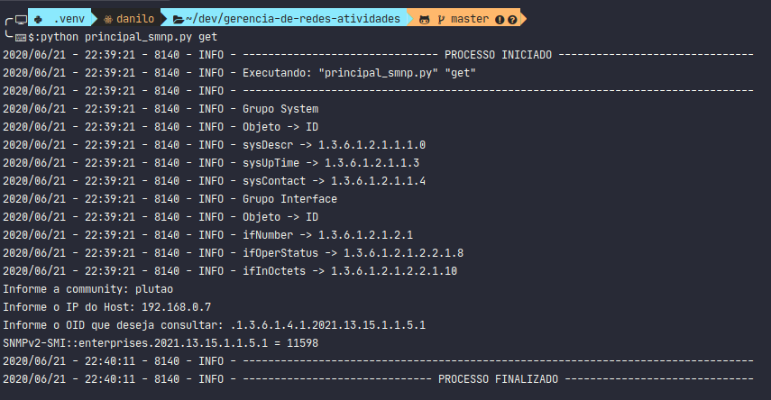
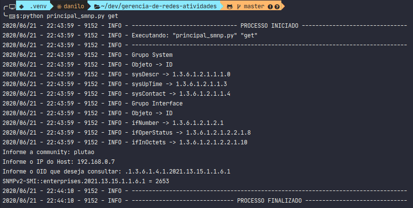

# **Atividade - Slide 4**

## Script Python

Implementar um script em python que resolva o exercício referente ao IO de
disco do Banco de dados. Está no slide 39 da Aula 03:

"Buscar nas MIBs um objeto que forneça informações sobre IO (Input/Output) de
disco. Você deve ter condições de a partir do snmpget obter o IO de Leitura e IO
de Escrita no seu disco."

